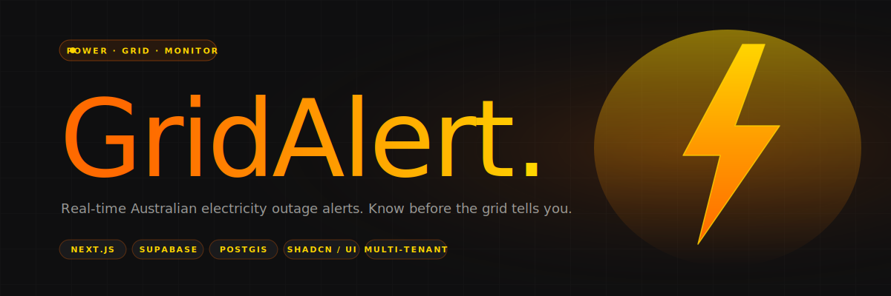

<div align="center">
  
</div>

<p align="center">
  
  
  
  
</p>

<br/>

> **GridAlert** is a real-time electricity-outage monitoring platform for Australian infrastructure owners — clinics, cold-storage operators, multi-site businesses, anyone who cannot afford an unexpected power cut. This repo is the **web portal**: where customers see their sites on a map, configure alert preferences, and manage their team.

<br/>

## What this repo is (and isn't)

**This repo is the frontend.** A Next.js app that gives subscribers a dashboard, a live outage map, site (POI) management, alerting preferences, and a multi-tenant admin surface. It talks to a Supabase database and authenticates users through Supabase Auth.

**This repo is *not* the ingestion pipeline.** The actual outage data — scraped continuously from each Australian power distributor's public feeds, normalised, de-duplicated, geocoded, and pushed to Postgres — is a separate service that isn't public. This portal consumes the output of that service via Supabase.

If you only want to see how the product works at the customer end, you're in the right place.

<br/>

## What it does

- **Live outage map** — current planned and unplanned outages across every major Australian distributor, rendered over a map with clustering and a per-outage detail drawer.
- **Points of Interest (POIs)** — customers register the physical sites they care about (fridges, warehouses, clinics). Each POI gets a risk score based on its proximity to active and forecast outages.
- **Alerting** — email/SMS when an outage intersects a POI or its forecast envelope.
- **Teams & invitations** — multi-user companies with role-based access. Invitations carry expiry (`expires_at`) and validation on acceptance.
- **Responsive everywhere** — the entire portal has paired desktop and mobile component variants (`DesktopInput` / `MobileInput`, etc.) because half the users log in from the ute.

<br/>

## Stack

| Layer | Tech |
|---|---|
| App framework | **Next.js 15** (App Router) · TypeScript |
| Database & auth | **Supabase** — Postgres with PostGIS for geospatial queries · Row-Level Security for tenancy |
| UI components | **shadcn/ui** + **HeroUI** · Radix primitives · Tailwind |
| Forms | React Hook Form · Zod |
| Maps | Google Places API for geocoding · map component backed by geospatial queries |
| Charts | Recharts |
| Package manager | pnpm |

<br/>

## Running locally

```bash
# 1. Install
pnpm install

# 2. Configure environment — copy the template and fill in
cp .env.local.example .env.local

# Required env vars
#   NEXT_PUBLIC_SUPABASE_URL         = your Supabase project URL
#   NEXT_PUBLIC_SUPABASE_ANON_KEY    = anon key
#   SUPABASE_SERVICE_ROLE_KEY        = service role key (server only)
#   NEXT_PUBLIC_GOOGLE_PLACES_KEY    = Google Places API key

# 3. Dev
pnpm dev

# 4. Production build
pnpm build
pnpm start
```

> **Important:** this frontend only works against an existing GridAlert Supabase instance. The schema, RLS policies, and ingestion jobs aren't bundled here — they're in a separate internal repo.

<br/>

## Database shape (the bits that are visible from here)

The schema lives under the `gridalert.*` schema in Postgres. The parts this portal reads:

```
companies            id, name, billing_tier
users_companies      user ↔ company mapping with role
invitations          pending invites with expires_at
pois                 customer sites — lat/lng, address, label, company
outages_planned      consolidated planned outages across all distributors
outages_unplanned    consolidated unplanned outages, continuously refreshed
```

All tables are gated by RLS — `auth.uid()` is matched to `users_companies.user_id` on every query, so no customer can ever read another tenant's data.

<br/>

## Conventions worth knowing

- Dialogs that have shipped are often marked **`*_DIALOG_STATUS.md`** at the repo root. These are implementation checklists — once a dialog passes its checklist, it's "locked" (don't touch without a reason).
- Desktop / mobile split is explicit — `DesktopInput` vs `MobileInput`, not CSS media queries for everything. Mobile uses touch-friendly popovers with scroll lock; desktop uses hover-state underlines.
- Orange `#FF6A00` → yellow `#FFD500` gradient is the GridAlert mark. It shows up on the landing site, in the portal logo, and on risk-score indicators.

<br/>

## Where this fits

GridAlert is **phase one of Arctiq's cold-chain monitoring play**. Arctiq makes RFID-retrofitted fridge monitors for medical clinics; GridAlert is the outside-signal layer that warns operators when a power event is about to hit one of their monitored assets. The fridge monitor tells you your vaccine storage is warming; GridAlert tells you the grid is about to cut out so you have time to react before it does.

<br/>

## License

No license granted. Source is visible here as part of my portfolio — **all rights reserved**. This is a commercial product: not licensed for redistribution, reuse, or forking into a competing offering. If you want to talk about it, [get in touch](https://github.com/KezLahd).

<br/>

---

<p align="center">
  <sub>Built by <a href="https://github.com/KezLahd">Kieran Jackson</a> · An <a href="https://arctiqservices.com.au">Arctiq</a> product · 2026 · Another <a href="https://instagram.com/kieranjxn">Kez Curation ↗</a></sub>
</p>
